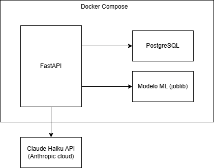
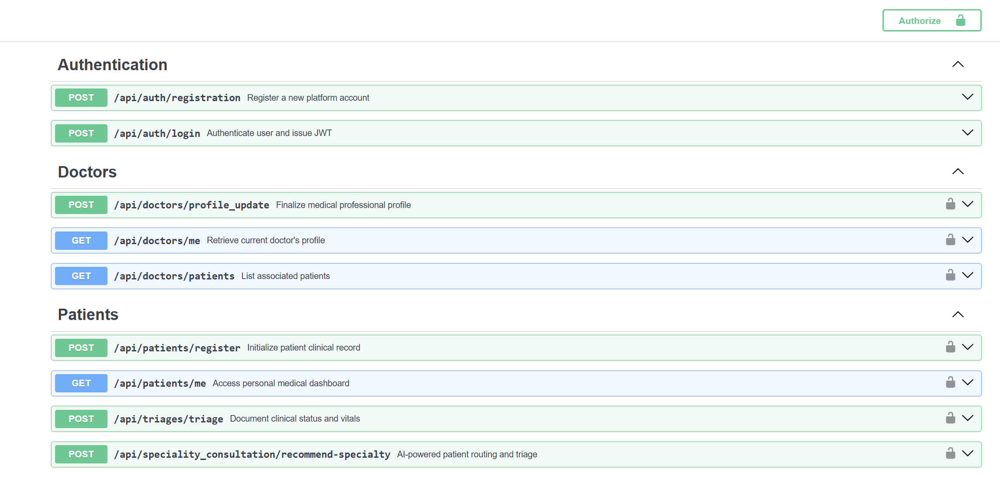
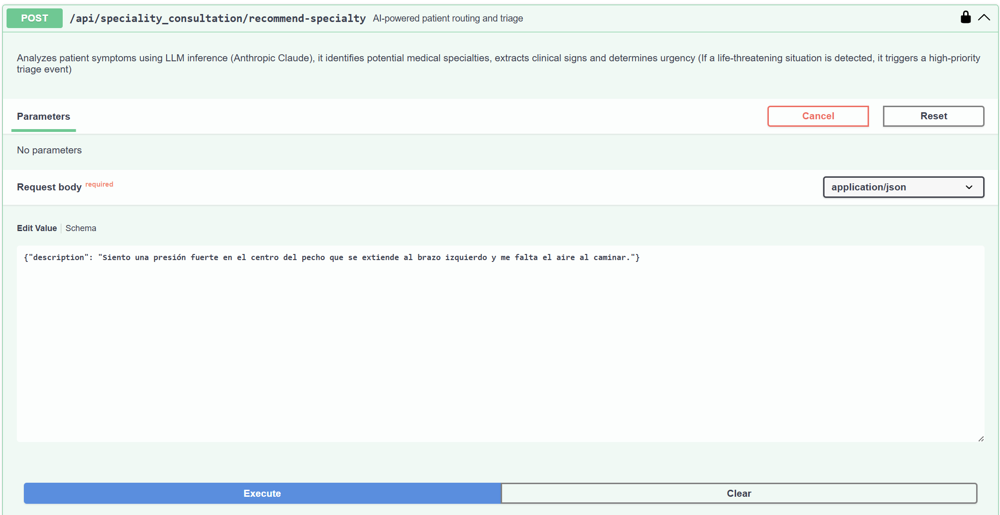
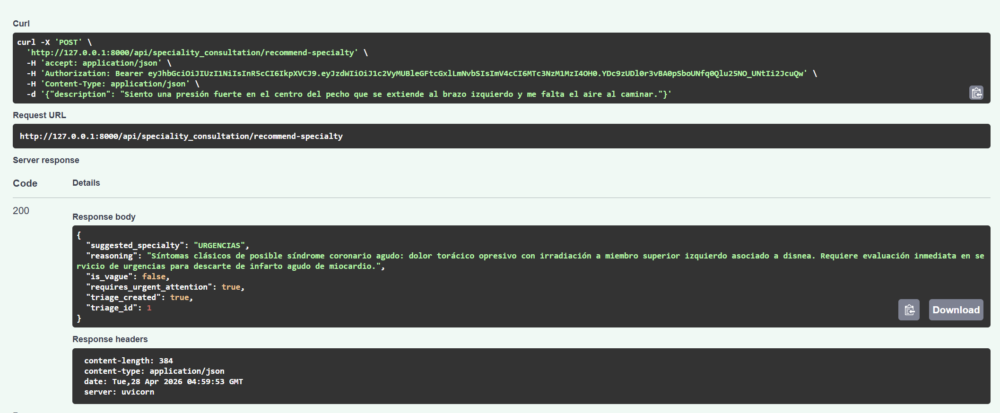

# MediQueue — API de Triaje Médico Inteligente


> Sistema backend para gestión de triaje hospitalario con Machine Learning e Inteligencia Artificial Generativa. Clasifica la urgencia de pacientes y los redirige directamente a especialistas, reduciendo costos operativos y optimizando tiempos de atención.

<!-- SCREENSHOT: Banner o GIF mostrando Swagger UI con los endpoints principales -->

---

## Tabla de Contenidos

- [El Problema](#-el-problema)
- [La Solución](#-la-solución)
- [Arquitectura](#-arquitectura)
- [Stack Tecnológico](#-stack-tecnológico)
- [Funcionalidades](#-funcionalidades)
- [Instalación](#-instalación)
- [Variables de Entorno](#-variables-de-entorno)
- [Uso de la API](#-uso-de-la-api)
- [Modelo de Machine Learning](#-modelo-de-machine-learning)
- [Decisiones de Diseño](#-decisiones-de-diseño)
- [Tests](#-tests)
- [Estructura del Proyecto](#-estructura-del-proyecto)

---

## El Problema

En una clínica tradicional, un paciente con síntomas debe:

1. Registrarse en recepción
2. Esperar turno con medicina general
3. Ser evaluado por el médico general
4. Ser redirigido al especialista correcto
5. Esperar otro turno con el especialista

Este proceso consume tiempo del paciente, tiempo del médico general y recursos de la clínica — incluso cuando el caso podría ir directamente al especialista.

---

## La Solución

MediQueue digitaliza y automatiza el flujo de triaje en tres niveles:

**Nivel 1 — Triaje clásico:** el médico registra signos vitales y un modelo de ML clasifica la prioridad de atención del 1 al 5.

**Nivel 2 — Recomendación inteligente:** el paciente describe sus síntomas en lenguaje natural y Claude Haiku lo redirige directamente al especialista correcto, saltándose medicina general.

**Nivel 3 — Triaje automático de emergencia:** si Claude detecta riesgo vital, crea automáticamente un triaje con prioridad máxima sin intervención humana.

---

## Arquitectura



### Flujo de recomendación de especialista

```
Paciente describe síntomas (texto libre)
            │
            ▼
    Claude Haiku extrae JSON estructurado
    (síntomas, duración, signos vitales)
            │
            ├──── is_vague? ──▶ Pide más detalles
            │
            ├──── URGENCIAS? ──▶ Crea triaje automático (prioridad 1)
            │                    └── Sin doctor asignado? ──▶ Alerta inmediata
            │
            └──── Normal ──▶ Recomienda especialista + reasoning
```

---

## Stack Tecnológico

| Capa | Tecnología | Uso |
|------|-----------|-----|
| Framework | FastAPI | API REST asíncrona |
| ORM | SQLAlchemy + Alembic | Modelos y migraciones |
| Base de datos | PostgreSQL 16 | Persistencia |
| Autenticación | JWT + bcrypt | Seguridad |
| ML | scikit-learn | Clasificación de triaje |
| NLP | TF-IDF Vectorizer | Vectorización de síntomas |
| IA Generativa | Claude Haiku (Anthropic) | Extracción y recomendación |
| Contenedores | Docker + docker-compose | Infraestructura |
| Testing | pytest | Tests unitarios e integración |

---

## Funcionalidades

### Para Médicos
- Registro y autenticación con JWT
- Completar perfil profesional (especialidad, licencia médica)
- Registrar pacientes por DNI — incluso antes de que tengan cuenta
- Ver lista de pacientes activos asignados
- Crear triajes con signos vitales y obtener clasificación ML automática
- Agregar notas clínicas a cada triaje
- Desactivar relación con un paciente

### Para Pacientes
- Reclamar cuenta pre-creada por médico o registro tradicional
- Ver perfil propio y médico asignado
- Consultar historial de triajes
- **Describir síntomas en lenguaje natural y recibir recomendación de especialista**

### Inteligencia Artificial
- Extracción estructurada de síntomas desde texto libre
- Recomendación de especialista entre 9 especialidades
- Detección automática de riesgo vital
- Creación automática de triaje de emergencia
- Manejo de síntomas vagos o poco específicos

---

## Instalación

### Prerrequisitos

- Docker y docker-compose instalados
- API Key de Anthropic ([obtener aquí](https://console.anthropic.com))

### 1. Clonar el repositorio

```bash
git clone https://github.com/tu-usuario/mediqueue.git
cd mediqueue
```

### 2. Configurar variables de entorno

```bash
cp .env.example .env
# Editar .env con tus valores
```

### 3. Levantar con Docker

```bash
docker-compose up --build
```

### 4. Acceder a la documentación

```
http://localhost:8000/docs
```

La base de datos se inicializa automáticamente en el primer arranque.

---

## Variables de Entorno

```env
# Base de datos
DB_USER=postgres
DB_PASSWORD=your_password
DB_NAME=mediqueue
DB_HOST=db
DB_PORT=5432

# Seguridad
SECRET_KEY=your_secret_key_here
ALGORITHM=HS256
ACCESS_TOKEN_EXPIRE_MINUTES=30

# Anthropic
ANTHROPIC_API_KEY=sk-ant-...

# Desarrollo
MOCK_AI=false
```

---

## Uso de la API

La API completa está documentada en Swagger (`/docs`) y ReDoc (`/redoc`).



### Flujo típico de uso

**1. Registrar médico y completar perfil**
```bash
POST /api/auth/registration
POST /api/doctors/profile_update
```

**2. El médico registra un paciente por DNI**
```bash
POST /api/patients/register
```

**3. El paciente reclama su cuenta**
```bash
POST /api/auth/registration  # Con el mismo DNI
```

**4. Crear un triaje clásico**
```bash
POST /api/triage/
```

**5. Recomendación inteligente de especialista**
```bash
POST /api/inquiry/recommend-specialty
```

```json
// Request
{
  "description": "Llevo 3 días con dolor fuerte en el pecho que se irradia al brazo izquierdo, me falta el aire y sudo mucho"
}

// Response
{
  "suggested_specialty": "URGENCIAS",
  "reasoning": "Síntomas compatibles con evento cardíaco agudo...",
  "is_vague": false,
  "requires_urgent_attention": true,
  "triage_created": true,
  "triage_id": 42
}
```




---

## Modelo de Machine Learning

El modelo clasifica la prioridad de triaje en una escala del 1 (crítico) al 5 (leve).

### Pipeline

```
Texto de síntomas → TF-IDF Vectorizer → Logistic Regression → Prioridad (1-5)
```

### Entrenamiento

El notebook de entrenamiento está disponible en `ml/training.ipynb`. Incluye:
- Exploración del dataset
- Preprocesamiento y limpieza
- Entrenamiento y evaluación
- Serialización con joblib

<!-- SCREENSHOT: Captura del notebook mostrando métricas del modelo:
     matriz de confusión, precisión, recall -->

---

## Decisiones de Diseño

**DNI como identificador universal:** permite al médico registrar pacientes que aún no tienen cuenta, anticipando el flujo real de una clínica. El paciente reclama su cuenta posteriormente usando el mismo DNI.

**Separación User / Patient / Doctor:** la autenticación es independiente del rol clínico. Un `User` puede existir sin perfil completo (estado PENDING), lo que habilita el flujo de pre-registro médico.

**Relación Doctor-Paciente muchos a muchos:** un paciente puede tener múltiples médicos activos simultáneamente, y la relación puede desactivarse sin eliminar el historial.

**ML + LLM coexistiendo:** el modelo ML clasifica urgencia con datos estructurados (signos vitales numéricos). Claude maneja lenguaje natural. Cada tecnología hace lo que mejor sabe hacer.

**Endpoint asíncrono para IA:** la llamada a Claude usa `AsyncAnthropic` para no bloquear el servidor mientras espera respuesta, comportamiento correcto para un entorno de producción con múltiples peticiones simultáneas.

**Mock mode para desarrollo:** variable `MOCK_AI=true` evita llamadas reales a la API de Anthropic durante desarrollo y testing, reduciendo costos.

---

## Tests

```bash
# Dentro del contenedor
docker-compose exec app pytest

# Con cobertura
docker-compose exec app pytest --cov=app tests/
```

Los tests cubren autenticación, gestión de médicos y pacientes, creación de triajes y el endpoint de recomendación con mock de Claude.

---

## Estructura del Proyecto

```
mediqueue/
├── app/
│   ├── main.py
│   ├── api/
│   │   ├── dependencies.py
│   │   ├── auth.py
│   │   ├── doctors.py
│   │   ├── patients.py
│   │   ├── triage.py
│   │   └── inquiry.py
│   ├── core/
│   │   ├── config.py
│   │   └── security.py
│   ├── db/
│   │   ├── base.py
│   │   └── session.py
│   └── schemas/
│       ├── user.py
│       ├── doctor.py
│       ├── patient.py
│       └── patient_inquiry.py
├── ml/
│   ├── training.ipynb
│   └── model.joblib
├── tests/
├── .env.example
├── .gitignore
├── docker-compose.yml
├── Dockerfile
└── requirements.txt
```

